<div align="center">




<br>


<br>


<br><br>

<a href="https://github.com/esammostafa9-cloud?tab=repositories"></a>
<a href="https://www.linkedin.com/in/esam-alareqi9027b230a"></a>
<a href="mailto:esammostafa9@gmail.com"></a>
<a href="https://github.com/esammostafa9-cloud"></a>

<br><br>


<a href="https://github.com/esammostafa9-cloud?tab=followers"></a>
<a href="https://github.com/esammostafa9-cloud"></a>

</div>



## About

I am Esam Mustafa Ali Abduljalil Alareqi, a third-year Bachelor of Computer Science (Artificial Intelligence & Data Science) student at Taylor's University in Kuala Lumpur, Malaysia.

My goal is to build production-ready AI systems that solve real-world problems in Machine Learning, Computer Vision, and Generative AI, and to contribute to open-source AI projects. I have completed the IBM AI Engineering Professional Certificate, along with courses in generative AI, AI fundamentals, and SQL. I am currently studying Large Language Models, Retrieval-Augmented Generation, LangChain, the Model Context Protocol, AI Agents, and MLOps, and I build agentic AI workflows with tools like Claude Code and Google Antigravity.

The repositories on this profile are university coursework and personal study projects. They document what I am learning: image classification with transfer learning, RAG pipelines with LangChain, IoT system design, and data analysis.

<div align="center">

| Focus Area | Current State |
|:---|:---|
| Machine Learning | Hands-on through coursework and certifications |
| Deep Learning & Computer Vision | Hands-on projects with CNNs and transfer learning |
| Generative AI, LLMs & RAG | Studying, with a LangChain capstone project |
| Agentic AI Workflows & Automation | Building with Claude Code, Google Antigravity, and MCP |
| MLOps & Deployment | Foundational, using Gradio and Hugging Face Spaces |

</div>


## Open To

<div align="center">

<a href="mailto:esammostafa9@gmail.com"></a>
<a href="mailto:esammostafa9@gmail.com"></a>
<a href="mailto:esammostafa9@gmail.com"></a>
<a href="https://github.com/esammostafa9-cloud?tab=repositories"></a>

</div>


## Education

**Bachelor of Computer Science (Artificial Intelligence & Data Science)**
Taylor's University — Kuala Lumpur, Malaysia — Third Year

- Coursework in machine learning, deep learning, computer vision, and natural language processing
- Data science foundations: data mining, preprocessing, visualization, and statistical analysis
- Software engineering, database design, data structures and algorithms in Java and Python
- Systems coursework covering computer networks and operating systems
- Applied group work, including the CareerConnect academic project


## Tech Stack

<div align="center">

**Languages**


**AI & Machine Learning**


**Cloud & Deployment**


<br>


<br>


<br>


<br><br>

**Study Tracks In Progress**


<br>


</div>


## AI & Data Science Focus

<div align="center">

| Domain | Level | Details |
|:---|:---:|:---|
| Machine Learning | Hands-on | Regression, classification, feature engineering, model evaluation |
| Deep Learning | Hands-on | CNNs, transfer learning with ResNet50, fine-tuning, ANN development |
| Computer Vision | Hands-on | Image classification, preprocessing, confusion matrix analysis |
| Generative AI & LLMs | Studying | LangChain, RAG, and LLM concepts applied in a capstone project |
| Agentic AI & Automation | Hands-on | Agent workflows with Claude Code, Google Antigravity, and MCP |
| Data Science | Hands-on | Pandas, NumPy, data cleaning, visualization with Tableau and Power BI |
| NLP | Foundational | Coursework project on natural language processing |
| MLOps & Deployment | Foundational | Gradio demos, Hugging Face Spaces, GitHub Actions |

</div>


## Featured Projects

<details>
<summary><b>Flower Image Classification using ResNet50</b> — Transfer learning with TensorFlow, deployed on Hugging Face Spaces</summary>
<br>

An image classification project that fine-tunes a pretrained ResNet50 model with TensorFlow and Keras to classify flower species. The model was evaluated with a confusion matrix and classification report, wrapped in a Gradio interface, and deployed to Hugging Face Spaces.

| Aspect | Detail |
|:---|:---|
| Stack | Python, TensorFlow, Keras, ResNet50, Gradio, Hugging Face Spaces |
| Scale | Academic scope, single-model project on a public flower dataset |
| Performance | Evaluated with a confusion matrix and classification report |
| Security | Not applicable · academic scope |
| Impact | Learning project demonstrating transfer learning and model deployment |
| Repository | [flower-image-classification-resnet50](https://github.com/esammostafa9-cloud/flower-image-classification-resnet50) |

In plain terms: I taught an existing image-recognition model to identify flower species, measured how well it did, and put it online so anyone can try it.

</details>

<details>
<summary><b>Satellite Image Classification</b> — CNN and transfer learning on satellite imagery</summary>
<br>

A computer vision project that classifies satellite images using convolutional neural networks and transfer learning. The work covers image preprocessing, model training, and evaluation of the results.

| Aspect | Detail |
|:---|:---|
| Stack | Python, CNN, transfer learning, image preprocessing |
| Scale | Academic scope, coursework dataset |
| Performance | Evaluated with standard classification metrics |
| Security | Not applicable · academic scope |
| Impact | Learning project in remote-sensing image classification |
| Repository | [satellite-image-classification](https://github.com/esammostafa9-cloud/satellite-image-classification) |

In plain terms: I built a model that looks at satellite pictures and identifies what type of land or scene they show.

</details>

<details>
<summary><b>AI Engineering Capstone</b> — LangChain, RAG, and LLM application</summary>
<br>

The capstone project of the IBM AI Engineering track. It applies LangChain and Retrieval-Augmented Generation to build a generative AI application backed by a large language model.

| Aspect | Detail |
|:---|:---|
| Stack | Python, LangChain, RAG, large language models, generative AI |
| Scale | Academic scope, capstone project |
| Performance | Not applicable · academic scope |
| Security | Not applicable · academic scope |
| Impact | Learning project in retrieval-augmented LLM applications |
| Repository | [ai-engineering-capstone](https://github.com/esammostafa9-cloud/ai-engineering-capstone) |

In plain terms: I built an application that retrieves relevant documents and feeds them to a language model so its answers are grounded in real source material.

</details>

<details>
<summary><b>Smart Urban Noise Monitoring System</b> — IoT system design with LoRaWAN for smart cities</summary>
<br>

An IoT coursework project that designs a noise monitoring system for urban environments using LoRaWAN connectivity, aimed at smart-city use cases.

| Aspect | Detail |
|:---|:---|
| Stack | IoT, LoRaWAN, smart-city system design |
| Scale | Academic scope, system design project |
| Performance | Not applicable · academic scope |
| Security | Not applicable · academic scope |
| Impact | Learning project in IoT architecture for smart cities |
| Repository | [smart-urban-noise-monitoring](https://github.com/esammostafa9-cloud/smart-urban-noise-monitoring) |

In plain terms: I designed a network of low-power sensors that could measure city noise levels and send readings over long-range radio.

</details>

<details>
<summary><b>PM2.5 Air Pollution Prediction</b> — Regression modeling with feature engineering</summary>
<br>

A data science project that predicts PM2.5 air pollution levels using regression models. The work covers data cleaning, feature engineering, and model evaluation.

| Aspect | Detail |
|:---|:---|
| Stack | Python, regression, feature engineering, data cleaning |
| Scale | Academic scope, coursework dataset |
| Performance | Evaluated with standard regression metrics |
| Security | Not applicable · academic scope |
| Impact | Learning project in environmental data modeling |
| Repository | [pm25-air-pollution-prediction](https://github.com/esammostafa9-cloud/pm25-air-pollution-prediction) |

In plain terms: I cleaned real air-quality data and trained models to estimate fine-particle pollution levels from other measurements.

</details>

<details>
<summary><b>CareerConnect</b> — Academic group project, built with teammates</summary>
<br>

A group coursework project developed collaboratively with teammates. My contributions were system analysis, UI design, documentation, and software design. Implementation work was shared across the team.

| Aspect | Detail |
|:---|:---|
| Stack | System analysis, UI design, software design, documentation |
| Scale | Academic scope, team project |
| Performance | Not applicable · academic scope |
| Security | Not applicable · academic scope |
| Impact | Learning project in collaborative software development |
| Repository | [careerconnect](https://github.com/esammostafa9-cloud/careerconnect) |

In plain terms: my teammates and I designed a career platform as a class project; I handled the analysis, interface design, and documentation side.

</details>

<br>

**Additional academic work:** climate change data visualization, data mining preprocessing pipeline, NLP project, artificial neural network development, deep learning image recognition, software engineering and database design, Java OOP, data structures and algorithms, computer networks, operating systems, and an AI agents initiative.


## Experience

**Student — Taylor's University** · Kuala Lumpur, Malaysia

Third-year Computer Science (AI & Data Science) undergraduate. My practical experience so far comes from coursework, certifications, and personal projects.

- Built and evaluated machine learning and deep learning models in university and certification projects
- Deployed a computer vision demo with Gradio on Hugging Face Spaces
- Contributed system analysis, UI design, and documentation to a team software project
- Completed the IBM AI Engineering Professional Certificate program


## Achievements

<div align="center">

| Recognition | Details |
|:---|:---|
| IBM AI Engineering Professional Certificate | Completed certification program |
| AWS Generative AI Applications | Completed course |
| Google AI Essentials | Completed course |
| SQL and Relational Databases | Completed course |
| Model deployment | Computer vision demo live on Hugging Face Spaces |
| Academic portfolio | Coursework projects across AI, computer vision, IoT, and data science |
| Team collaboration | System analysis, UI design, and documentation on CareerConnect |

</div>


## Certifications

**Completed**

- IBM AI Engineering Professional Certificate
- AWS Generative AI Applications
- Google AI Essentials
- SQL and Relational Databases

**Certification Roadmap — 5-Step Path (targets, not yet earned)**

<div align="center">


<br><br>

| Step | Certification | Category | Key Skills |
|:---:|:---|:---|:---|
| 1 | GitHub Foundations | Preparatory | Source control (Git) · GitHub collaboration (PRs, issues) · dev workflow basics |
| 2 | Microsoft Certified: Azure AI Fundamentals (AI-901) | AI & App Developer | Core AI concepts · responsible AI · Microsoft AI services |
| 3 | Microsoft Certified: Azure AI App & Agent Developer (Associate) | AI & App Developer | Designing AI applications · building AI agents · agent orchestration & MLOps |
| 4 | AWS Certified AI Practitioner (Foundational) | Cloud & Network | ML fundamentals on AWS · cross-cloud AI overview · security and compliance for AI |
| 5 | Cisco Certified Network Associate (CCNA) | Cloud & Network | IP connectivity & routing · security fundamentals · automation & programmability |

</div>


## Coding Profiles

<div align="center">

<a href="https://github.com/esammostafa9-cloud"></a>
<a href="https://github.com/esammostafa9-cloud?tab=repositories"></a>

</div>


## GitHub Analytics

<div align="center">


<br><br>


<br><br>


</div>


## Contribution Activity

<div align="center">


</div>


## Contribution Snake

<div align="center">


</div>


## Current Focus

```yaml
learning:
  - Advanced Deep Learning
  - Large Language Models
  - Retrieval-Augmented Generation (RAG)
  - LangChain
  - Model Context Protocol (MCP)
  - AI Agents
  - MLOps

building:
  - Agentic AI workflows and automations
  - Computer vision classifiers with transfer learning
  - RAG pipelines with LangChain

exploring:
  - Agentic developer tools (Claude Code, Google Antigravity)
  - Open-source AI projects
  - Production-ready AI system design

open_to:
  - AI / ML / Computer Vision internships
  - Project collaboration
  - Open-source contribution
```


## Connect

<div align="center">

<a href="mailto:esammostafa9@gmail.com"></a>
<a href="https://www.linkedin.com/in/esam-alareqi9027b230a"></a>
<a href="https://github.com/esammostafa9-cloud"></a>
<a href="https://github.com/esammostafa9-cloud?tab=repositories"></a>

</div>


<div align="center">

*"I learn by building, and I share what I build."*

<br>



</div>
